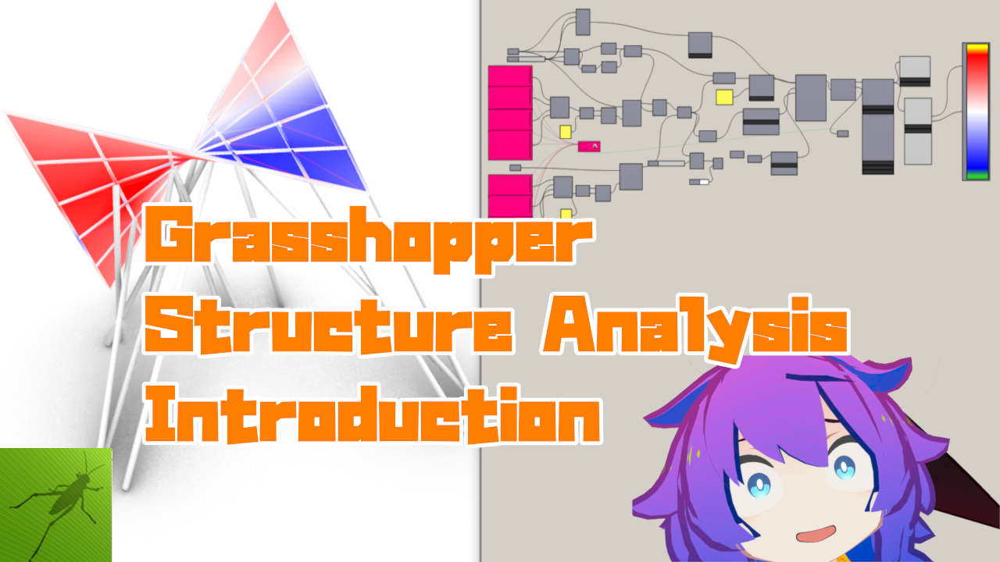
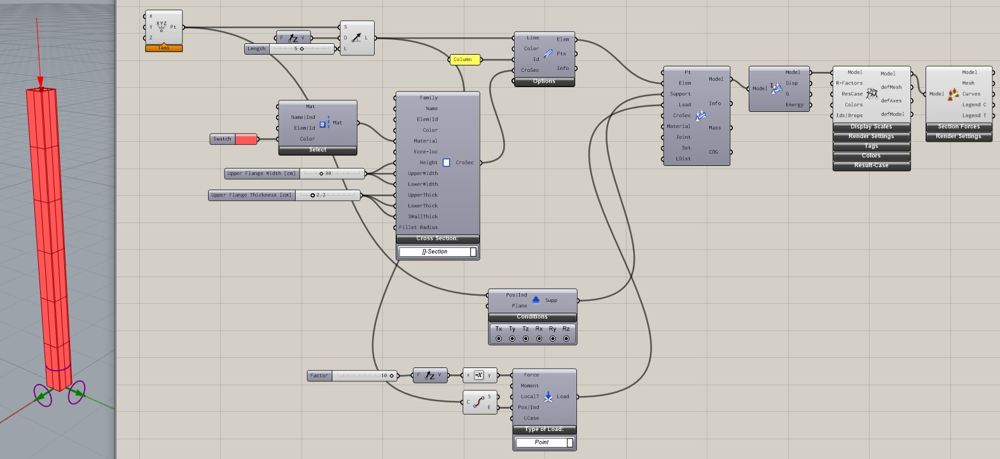
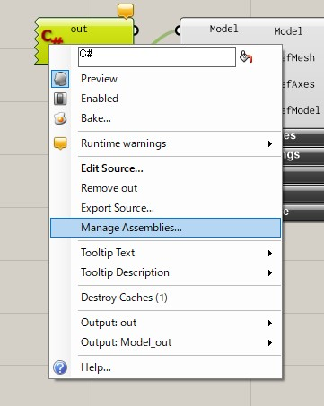

# Structural Analysis Coding with Karamba

## はじめに

Tokyo AEC Industry Dev Group で 2020/10/10 に行われるハンズオンの資料です。Tokyo AEC Industry Dev Group についての詳細は以下を参照してください。

[Tokyo AEC Industry Dev Group Meetup Site](https://www.meetup.com/ja-JP/Tokyo-AEC-Industry-Dev-Group/events/xfrxvrybcnbnb/)

## 準備編

このワークショップでは 20/08/22 に行った Grasshopper を使ったの構造解析入門の続編です。
前回の内容はこちらです。

[](https://youtu.be/iYi5Y48zB2I)

今回は Karamba を使った解析をコンポーネントで行うだけでなく、C#Script から Karamba を使用し、解析を効率化させる方法の紹介します。

ワークショップの前に、以下のものを準備しておいてください。

- Karamba のインストール(Trial 版ではなく Free 版)
  - https://www.food4rhino.com/app/karamba3d
- Karamba の Scripting Guide Examples
  - https://www.karamba3d.com/download/karamba3d-1-3-2-scripting-guide-examples/?wpdmdl=7759&masterkey=5d4a003883d21

## 柱の解析

### Grasshopper でコンポーネントを使ってモデルづくり

最初から Karamba を使ったコーディングをするとわかりづらいので、はじめにコンポーネントを使ってモデリングしていきます。
作るものの条件は以下です。

- 断面形状：角型 30cmx30cm 板厚 2.2cm
- 材料：鋼材、色を赤にする
- 境界条件：下端固定
- 荷重：上端節点に対して、－Z 方向に 10kN
- 部材長：3m
- 部材の ID：Column

こんな形です。完成したデータは Data フォルダの column_model.gh です。



### 同じものを C#Script コンポーネントで作る

スクリプトで Karamba を使うためには、KarambaCommon.dll と Karamba.gha を使います。これは Karamba がインストールされたフォルダ内にあります。Karamba はデフォルトだと以下にあります。以下のフォルダには KarambaCommon.dll とは別に Karamba.dll がありますが、こちらは C++で書かれた Karamba の構造計算を実際に行っている部分になります。

> C:\Program Files\Rhino6\Plug-ins\Karamba\karambaCommon.dll

これだけだとどんなクラスがあるかわからないので、準備編でダウンロードした Karamba の Scripting Guide Examples を使います。この中に Karamba3D_1.3.2_Documentation.chm があるのでそれを開くと Karamba の SDK を確認できます。

基本的にはメソッドへの入力と出力がコンポーネントの入出力ほぼ同じ構成になっています。では先程作ったモデルを KarambaSDK を使って作成していきます。

最初に参照を追加します。C#Script コンポーネントを右クリックして Manage Assemblies... を選択して、その後 Referenced Assemblies の右側の Add から KarambaCommon.dll と Karamba.gha を追加します。



#### C#Script の内容

```cs
// usingに追加
using System.Drawing;
using Karamba.Utilities;
using Karamba.Geometry;
using Karamba.CrossSections;
using Karamba.Supports;
using Karamba.Loads;

public class Script_Instance : GH_ScriptInstance
{
    private void RunScript(ref object ModelOut, ref object MaxDisp)
    {
        var logger = new MessageLogger();
        var k3d = new KarambaCommon.Toolkit();

        // karamba用のlineを作成
        // 名前が似ていますが、Point3もLine3のKaramba.Geometryの構造体です。
        var p0 = new Point3(0, 0, 0);
        var p1 = new Point3(0, 0, 5);
        var L0 = new Line3(p0, p1);

        // 材料の作成
        var E = 210000000;  // kN/m2
        var G = 80760000;  // kN/m2
        var gamma = 78.5;  // kN/m3
        var material = new FemMaterial_Isotrop("Steel", "SN400", E, G, G, gamma, 0, 0, Color.Brown);

        // 断面の作成
        double height = 30;  // cm
        double width = 30;
        double thickness = 2.2;
        double fillet = 2.5 * thickness;
        var croSec = new CroSec_Box("Box", "Box", null, null, material, height, width, width, thickness, thickness, thickness, fillet);

        // Beamを作成
        // 入力は、Line、Id、CrossSection
        var nodes = new List<Point3>();
        var elems = k3d.Part.LineToBeam(new List<Line3>(){ L0 }, new List<string>(){ "Column" }, new List<CroSec>( croSec ), logger, out nodes);

        // 境界条件の作成
        // 入力は、条件を指定するPoint3と各変位の拘束のBoolean
        var support = k3d.Support.Support(p0, new List<bool>(){true, true, true, true, true, true});
        var supports = new List<Support>(){support};

        // 荷重の作成
        // 入力は、条件を指定するPoint3、荷重のベクトル、モーメントのベクトル、荷重ケース
        var pload = k3d.Load.PointLoad(p1, new Vector3(0, 0, -10), new Vector3(), 0);
        var ploads = new List<Load>(){pload};

        double mass;  // 重量
        Point3 cog;  // 重心
        bool flag;
        string info;
        var model = k3d.Model.AssembleModel(elems, supports, ploads, out info, out mass, out cog, out info, out flag);

        // 解析を実行
        List<double> max_disps;
        List<double> out_g;
        List<double> out_comp;
        string message;
        model = k3d.Algorithms.AnalyzeThI(model, out max_disp, out out_g, out out_comp, out message);

        var ucf = UnitsConversionFactories.Conv();
        UnitConversion cm = ucf.cm();
        Print("max disp: " + cm.toUnit(max_disp[0]) + cm.unitB);

        ModelOut = new Karamba.GHopper.Models.GH_Model(model);
        MaxDisp = cm.toUnit(max_disp.Max());
    }
}
```

## 最適化を行う

### あああ

あああ

---

## その他

### 紹介と宣伝

HoaryFox の Karamba へのコンバート機能は今日の内容を使用しています。
[](https://www.food4rhino.com/app/hoaryfox)

ST-Bridge データに限らず IFC や各 BIM ソフトはこういった部材の断面情報や材料情報を持っているので、今日の技術が使えれば構造解析モデルの自動作成ができるようになります。
（BIM の入力の仕方によってうまくいかない点も多いですが…）

### コンタクト

[](https://twitter.com/hiron_rgkr)

- HP : [https://hrntsm.github.io/](https://hrntsm.github.io/)
- Blog : [https://rgkr-memo.blogspot.com/](https://rgkr-memo.blogspot.com/)
- Mail : support(at)hrntsm.com
  - change (at) to @
